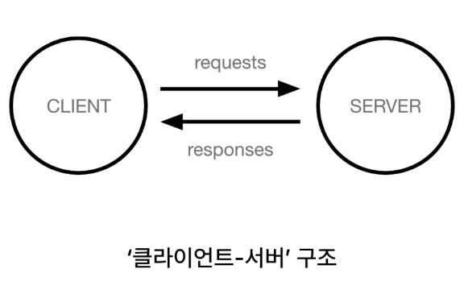
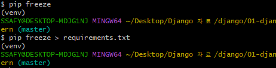
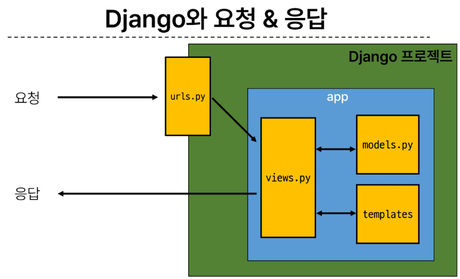

# 1. Django Intro & Design Pattern

## 목차
0. Framework
1. Django and Framework
- Framework
- Django framework
- 클라이언트와 서버
- Django 프로젝트 및 가상환경
2. Django Design Pattern
- Django 프로젝트와 앱
- Django 디자인 패턴
- 요청과 응답

## 1. Django and Framework

## 1-1. Framework
### 웹 서비스 개발에 필요한 것 
- 로그인, 로그아웃, 회원관리, 데이터베이스, 보안, ...
- 모든 것을 직접 만들 필요 없이, 잘 만들어진 것들을 가져와 좋은 환경에서 사용하기

### Framework
프레임워크 : 웹 애플리케이션을 빠르게 개발할 수 있도록 도와주는 도구
- 개발에 필요한 기본 구조, 규칙, 라이브러리 등을 제공
- 필수적인 핵심 개발에 집중 가능
- 생산성의 향상
- 유지보수 및 확장의 용이성(소프트웨어의 품질 상승)

### 1-2. Django
Django : Python 기반의 대표적인 웹 프레임워크

### 1-3. 클라이언트와 서버

#### Client & Server
클라이언트 : 서비스를 요청하는 주체
- 웹 사용자의 인터넷이 연결된 장치, 웹 브라우저
서버 : 클라이언트의 요청에 응답하는 주체
- 웹 페이지, 앱을 저장하는 컴퓨터
#### 웹 페이지를 보는 과정
1. 웹 브라우저(클라이언트)에서 'google.com' 입력
2. 브라우저는 인터넷에 연결된 전세계 어딘가에 이는 구글 컴퓨터(서버)에게 'Google의 홈페이지.html' 파일을 달라고 요청
3. 요청 받은 구글 컴퓨터는 데이터베이스에서 'Google 홈페이지.html' 파일을 찾아 응답
4. 전달받은 Google 홈페이지.html 파일을 웹 브라우저가 사람이 볼 수 있도록 해석해주어 사용자가 구글의 메인 페이지를 보게 됨
#### 우리의 목표
Django를 사용하여 '서버' 구현

### 1-4. 프로젝트 및 가상환경
가상환경 : Python 애플리케이션과 그에 따른 패키지들을 격리하여 관리할 수 있는 독립적인 실행 환경
#### 가상환경의 필요성
- 한 개발자가 두 개의 프로젝트 A와 B를 진행
- 프로젝트 A : requests 패키지 버전 1 사용
- 프로젝트 B : requests 패키지 버전 2 사용
- 파이썬 환경에서 패키지는 한 개의 버전만 존재
- ---> 다른 패키지 버전 사용을 위한 독립적인 개발 환경 필요

#### 가상환경 생성 절차
public documents -> python -> Python 가상환경 설정 들어가서 참고
1. 가상환경 만들기
- git bash -> python -m venv venv : 가상환경 이름을 venv로 만들거야
2. 가상환경 활성화(이동의 개념이 아닌, on/off 개념)
- source venv/Scripts/activate
- venv 폴더에 Scripts 폴더에 있는 activate : 가상환경을 켜주는 기능
- (가상환경이름)이 명령어 위에 떠있다면 activate 되어있음을 알려주는 것
3. 가상환경 비활성화
- deactivate
4. 환경에 설치된 패키지 목록 확인
- pip list

#### 패키지 목록의 필요성
- A와 B가 하나의 프로젝트를 함께 개발
- A가 먼저 가상환경을 생성 후 프로젝트를 설정하고 관련된 패키지를 설치하고 개발하다가 협업을 위해 github에 프로젝트를 push
- B는 해당 프로젝트를 clone받고 실행해보려 하지만 실패
  - 이유 : A가 프로젝트를 위해 설치한 패키지와 버전 등 A의 가상환경에 대해 B가 알 수 없다
- 즉, 패키지 목록이 공유되어야 함(txt 형태로)

<A가 해야 하는 일>
- pip install requests
- pip freeze > requirements.txt로 텍스트 파일 추가
  - 안에 txt형태로 정보가 담김(B가 알아야 할 정보들)
<B가 해야 하는 일>
- python -m venv venv : 가상환경 만들기
- source venv/Scripts/activate : 가상환경 활성화
- pip install -r requirements.txt : requirements.txt에 입력되어있는 해당 가상환경에 필요한 설치 목록들을 한 번에 설치
- pip list : 설치 후 동일한 가상환경이 같은지 확인

#### 의존성 패키지
- 한 소프트웨어 패키지가 다른 패키지의 기능이나 코드를 사용하기 때문에 그 패키지가 존재해야만 제대로 작동하는 관계
- 사용하려는 패키지가 설치되지 않았거나, 호환되는 버전이 아니면 오류가 발생하거나 예상치 못한 동작을 보일 수 있음
ex. requests 설치 후 설치되는 패키지 목록 변화 : 한 개만 설치되는 것이 아님(requests 패키지를 위해 필요한 패키지도 함께 설치)
- 개발환경에서 각각의 프로젝트가 사용하는 패키지와 그 버전을 정확히 관리하는 것이 중요
- pip freeze > requirements.txt : 의존성 패키지 목록 생성

<Django 프로젝트 생성 전 루틴>
1. 가상환경 생성
- python -m venv venv
2. 가상환경 활성화
- source venv/Scripts/activate
  - 비활성화 : deactivate
3. Django 설치
- pip install Django
4. 의존성 파일 생성(패키지 설치 시 마다 진행)
- pip freeze > requirements.txt
5. .gitignore 파일 생성(첫 add 전)
6. git 저장소 생성
7. Django 프로젝트 생성

## 2. Django Design Pattern

### 2-1. Django 프로젝트와 앱
Django project : 애플리케이션의 집합
- DB 설정, URL 연결, 전체 앱 설정 등을 처리
Django application : 독립적으로 작동하는 기능 단위 모듈
- 각자 특정 기능을 담당하며 다른 앱들과 함께 하나의 프로젝트 구성

#### 앱 사용 과정
1. 앱 생성
- python manage.py startapp articles : articles 라는 앱의 이름을 생성할거야
  - 앱의 이름은 복수형으로 지정하는 것을 권장
2. 앱 등록 : 앱을 생성한 후 반드시 등록(역순 x)
- firstpjt -> settings.py -> INSTALLED_APPS 변수에 생성한 앱 추가

### 2-2. Django 디자인 패턴
디자인 패턴 : 소프트웨어 설계에서 발생하는 문제를 해결하기 위한 일반적인 해결책
- 공통적인 문제를 해결하는 데 쓰이는 형식화 된 관행
- Django가 사용하는 디자인 패턴 : MVC 디자인 패턴

#### MVC 디자인 패턴(Model, View, Controller)
MVC 디자인 패턴 : 애플리케이션을 구조화하는 대표적인 패턴
- 데이터, 사용자 인터페이스, 비즈니스 로직을 분리
- 시각적 요소(View)와 뒤에서 실행되는 로직(Controller)을 서로 영향 없이, 독립적이고 쉽게 유지 보수할 수 있는 애플리케이션을 만들기 위해

MTV 디자인 패턴(Model, Template, View) : Django에서 애플리케이션을 구조화하는 패턴
- 기존 MVC패턴과 동일(명칭의 차이)

#### 프로젝트의 구조
수정을 진행할 부분
- settings.py : 프로젝트의 모든 설정 관리
- urls.py : URL과 이에 해당하는 적절한 views를 연결

수업중에 안건드릴 부분
- __init__.py : 해당 폴더를 패키지로 인식하도록 설정
- asgi.py : 비동기식 웹 서버와의 연결 관련 설정
- wsgi.py : 웹 서버와의 연결 관련 설정
- manage.py : Django 프로젝트와 다양한 방법으로 상호작용 하는 커맨드라인 유틸리티

#### 앱의 구조
- admin.py : 관리자용 페이지 설정
- models.py : DB와 관련된 Model 정의(MTV의 M)
- views.py : HTTP 요청을 처리하고 해당 요청에 대한 응답을 반환(MTV의 v)
  - url, mode, template과 연계
- apps.py : 앱의 정보가 작성된 곳
- tests.py : 프로젝트 테스트 코드를 작성하는 곳

### 2-3. 요청과 응답

1. URLs
2. View
3. Template

#### Django에서 template을 인식하는 경로 규칙
데이터 흐름에 따라 코드 작성
- URLs -> View -> Template