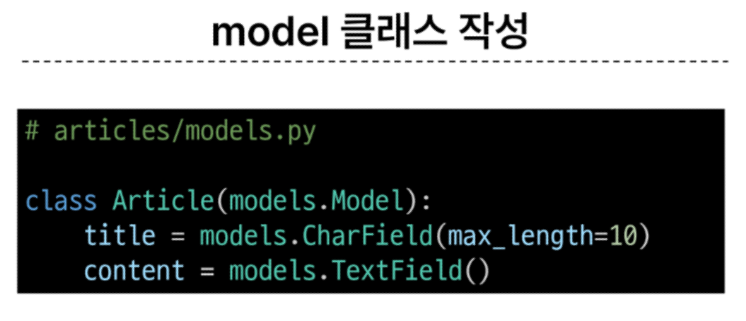

# 3. Django Model

## 목차
1. Model
2. Migrations
3. Admin site

## 1. Model
### Model
Model : Database를 관리하는 역할

- 테이블을 정의하고 데이터를 조작할(생성, 수정, 삭제) 수 있는 기능들을 저장
- models.py가 존재
- database(table들의 종합)과 소통하는 곳
- model 클래스를 작성하여 사용

#### 모델 클래스 작성

- Article, models, CharField, TextField class 사용 
- 모델 클래스는 곧 테이블 설계도

  - id Field : Django에서 자동으로 생성해줌
- 각 클래스 변수명 : 테이블의 각 필드(열) 이름
- model Field 클래스 : 해당 테이블 필드의 data type(필드별 데이터 타입은 고정)
  - model Field 클래스의 키워드 인자(필드 옵션) : 해당 테이블 필드의 제약조건
## 2. Migrations
### Migrations
Migrations : model 클래스의 변경사항(필드 생성, 수정, 삭제 등)을 DB에 최종 반영하는 방법
#### Migrations의 과정
1. model class(설계도 초안)
2. migration 파일(최종 설계도)
3. db.sqlite3(DB)
#### Migrations의 핵심 명령어
1 -> 2 : python manage.py makemigrations 
- model class를 기반으로 최종 설계도(migration) 작성
2 -> 3 : python manage.py migrate
- 앞서 만들어낸 최종 설계도를 DB에 전달하여 반영

#### migrate 이후 DB 확인

#### 테이블 생성 후 변경사항이 생기는 경우
- 
## 3. Admin site