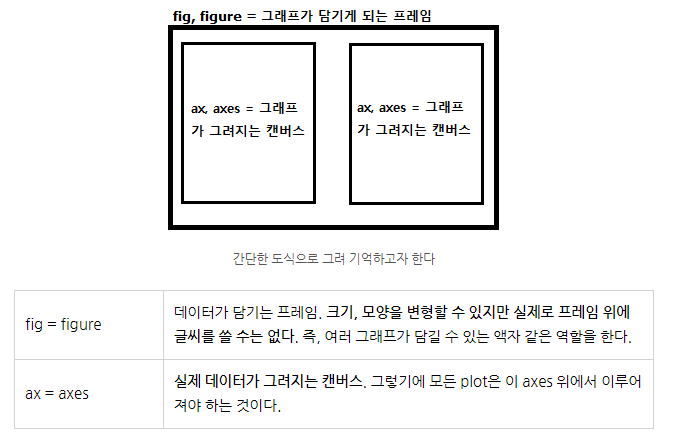

# 서울 3반 관통 PJT

## Ver-1 (신규)
- 금융 데이터를 활용한 금융 상품 비교 애플리케이션

### 02-pjt
넷플릭스 주가 데이터 분석
- 캐글의 넷플릭스 주가 데이터를 담은 데이터셋
- 2018-02-05 ~ 2022-02-04까지의 일별 데이터 
- 변수 : Date, Open, High, Low, Close만 전처리하여 사용

#### TIL
1. 개인적으로 주피터 노트북을 이용하여 데이터셋을 전처리하고 이를 분석한 후 시각화 한 경험이 있다. 이를 이용하여 오늘 관통 프로젝트를 쉽게 끝낼 수 있을 것이라고 약간의 자만을 하며 시작했지만, 새로운 내용들과 활용이 너무 많았다.
2. 먼저, csv 파일을 이용하여 새로운 df를 생성하는 방법이다. 기존에는 read_csv로밖에 데이터프레임을 생성 해 본 적이 없기 때문에, 파일을 불러와서 넘파이 배열로 만들어주는 np의 loadtxt() 메서드를 사용하는 방법을 알게 되었다. 개인적으로는 이 방법이 더 명시적이고, 사람들 입장에서 데이터프레임 생성의 단계를 알기 쉽게 해 준다고 생각한다. 이후 이 np.array를 데이터프레임으로 바꾸는 과정에서
오늘 사용하지 않는 Column들인 Adj Close, Volume을 빼고 나머지 col들만 사용하게 하였다. 데이터 전처리하는 과정을 오랜만에 해 보았는데, header을 따로 지정해서 하는 것이 조금 더 명확할 것이라는 생각이 들었다.
3. 이후, 이 데이터프레임 중 그때마다 필요한 데이터만 추출하여 사용하는 연습을 하였다. 그 과정에서 모든 데이터들의 col별 dtype을 확인해 보니, 모두 object였다. 사실 나는 이 object라는 것이 데이터 타입(int, float, ,,,)을 한 번에 지칭하는 말인 줄 알아서 그대로 추출하려 했다. 하지만 이후 알고 보니, 각각의 col들의 dtype을 원하는 대로 바꿔줘야 함을 깨달았다. 특히, 'Date'라는 col_name을 가진 데이터는 yyyy-mm-dd 형태로 입력이 되어 있었는데, 이 dtype을 object에서 datetime이라는 것으로 바꿔줘야 함을 깨달았다. 이는 이후 날짜를 여러가지 기준으로 묶어줘야 함에 있어서 필요한 과정이었다. pd에 to_datetime()이라는 메서드로 이를 쉽게 바꿔줄 수 있었다. 말 그대로 "해당 값들의 dtype을 datetime으로 바꿔주세요!!"라는 의미를 가진 메서드였다. 나머지 'Open', 'High', 'Low', 'Close' 등의 col_name에 해당하는 데이터들도 각각 float형으로 바꿔줌으로써 데이터 전처리를 마칠 수있었다.
4. 위의 과정을 통해 내가 원하는 값들도 무리 없이 추출할 수 있었다. 또한, 이러한 완벽한 전처리 과정이 있어야 시각화에도 문제가 발생하지 않음을 깨달았다. 제대로 된 dtype이 아닐 경우, 시각화하는 것에서도 큰 문제가 발생하고, 내가 원하는 모양이 나오지 않음을 알게 되었다.
5. groupby라는 메서드 내에서 옵션들에 대해 알게 되었다. 아까 3번에서 말했던 것 처럼, datetime 타입으로 'Date'를 바꿔 준 이유는 우리의 데이터셋을 월별로 묶어서 보고 싶었기 때문이다. 내가 과거에 배웠던 내용은 .groupby(' ').sum()같이 어떤 것을 그룹화하여 그 데이터들의 합을 추출하는 것이었다. 하지만 배운 내용들에 더하여 구글링을 해 보니, 옵션으로 pd.Grouper()라는 것이 있었다. 해당 메서드 안에 key값과 freq를 넣을 수 있었는데, key는 우리가 묶어줄 데이터들의 col_name을, freq는 묶어주는 것의 기준 빈도수의 약자였다. 나같은 경우, 'Date'의 데이터들을 기준으로 하여 월별로 묶어주는 것이 목표였기 때문에, .groupby(pd.Grouper(key = 'Date', freq = 'M'))을 사용하였다. 이후는 우리가 아는 것 처럼 뒤에 그룹화하여 보여줄 col과 내용을 추가로 덧붙이면 되는 것이었다. 새로운 옵션을 알게 되었는데, 이후에도 활용도가 굉장히 높을 것 같다.
6. 여러가지 데이터 관계를 하나의 그래프에 표현하는 방식에 대해 좋은 설명이 있어서 이를 첨부하였다.

(출처 : https://m.blog.naver.com/allieverwanted/222146678032)

우리는 여러 서브플롯들을 하나의 그래프에 담아내기 위해 다음과 같은 식을 사용한다.
- fig, ax = plt.subplots()
- ax.plot(X1, y1, label = 'X1 & y1')
- ax.plot(X2, y2, label = 'X2 & y2)
- plt.legend()
과거에는 위의 실행을 그냥 그런가보다 라는 마음으로 외우다시피 하여 여러 데이터를 비교해야 할 경우 당연하게 사용하곤 했다. 하지만, 정작 이 실행 내용이 어떤 원리로 돌아가는지는 잘 몰랐던 기억이 난다. 그런데, 이 그림을 설명과 함께 보니 fig와 ax를 변수로 선언한 것이 어떤 의미인지를 깨달을 수 있었다.

## Ver-2 (기존)
- Open API 와 외부 데이터를 활용한 영화 추천 서비스

### 주의사항
- 선택은 04 PJT 까지 자유롭게 변경 가능
- 05 PJT 부터는 변경 불가 (최종프로젝트를 진행하기 위한 내용이 이어짐)