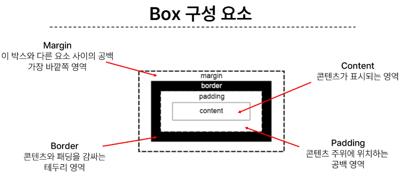
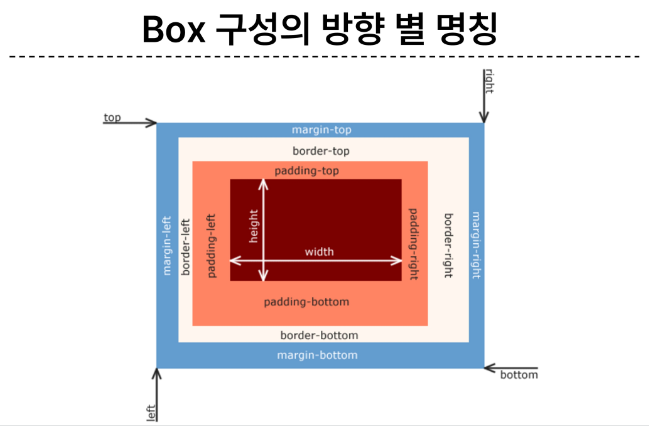
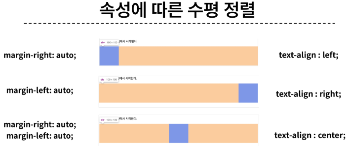
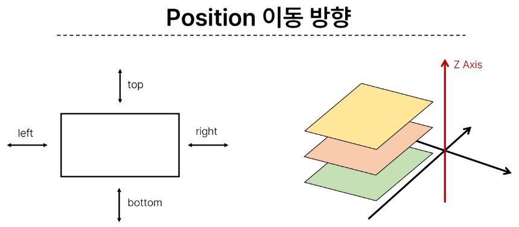

# 2. CSS Layout

## 목자
1. CSS Box Model
- 구성 요소
- 박스 타입
- 기타 display 속성
2. CSS Layout Position
- CSS Position
3. CSS Layout Flexbox
- 구성 요소
- 레이아웃 구성

## 1. CSS Box Model
CSS Box Model : 모든 HTML 요소를 사각형 박스로 표현하는 개념
- 모든 웹 페이지는 박스 요소들로 구조화 되어 있다.
### 1-1. 구성 요소
<Box Model의 구성 요소>

- Margin : 해당 박스와 다른 요소 사이의 공백
    - 가장 바깥쪽 영역
    - 기본값 : margin-left : auto(margin의 왼쪽 영역을 모두 오른쪽으로 보내서 좌측 정렬)
- Border : 컨텐츠와 패딩을 감싸는 테두리 영역
- Padding : 컨텐츠 주위의 공백 영역
- Content : 컨텐츠 표시 영역
<Box Model 구성 요소들의 방향 별 명칭>

- top / bottom / left / right
- 02-box-model 폴더의 01-part-of-box.html 확인

#### 단축키
padding & margin
- 두 가지 값 : 상하 / 좌우
- 세 가지 값 : 
#### width와 height 속성
1. width : 요소의 너비 지정
2. height : 요소의 높이 지정
- 컨텐츠 영역 대상으로 너비 및 높이 지정
- 실제로 해당 컨텐츠의 너비와 높이는 지정한 것보다 넓다!
    - 이유 : CSS가 해당 값을 계산하는 기준 : content
    - 결과 : 실제로 만들어지는 박스는 지정한 값보다 커짐 
    - 02-box-model 폴더의 02-box-sizing-html 확인
- box-sizing: border-box; 를 통해 조정

### 1-2. 박스 타입
박스 타입의 종류
1. block box
2. inline box
- 02-box-model 폴더의 03-block-inline.html 확인
#### 기본 웹페이지 요소 배치 방향
CSS를 적용하지 않은 경우 : Normal flow
- 태그 별로 방향이 정해짐 

1. Inline Direction(왼쪽에서 오른쪽으로 쌓이는 구조)
- 새로운 행으로 나뉘어지지 않는 구조(좌 -> 우)
- *width, height 속성 사용 불가* : 컨텐츠의 크기에 따라서 결정되기 때문
- 수직방향 : padding, margin, border이 적용 되지만, 다른 요소를 밀어내지 못함
- 수평방향 : padding, margin, border가 적용되어 다른 요소를 밀어낼 수 있음
- img, a, span 등이 inline direction을 가지는 inline type

2. Block Direction(위에서 아래로 쌓이는 구조)
- 항상 새로운 행으로 나뉘는 구조(위 -> 아래)
- 동일한 행의 남은 영역은 margin이 차지
- width, height 속성을 사용하여 너비와 높이 지정
    - width 속성을 사용하지 않을 시, block type의 box는 inline 방향으로 사용 가능한 공간을 모두 차지(width: 100%)
- h, p, div, list(ul, ol, li) 등이 block direction을 가지는 block type

<속성에 따른 수평 정렬 방법>

- Block type : margin을 조정하여 수평 영역 조정
- Inline type : text-align을 조정하여 수평 영역 조정

### 1-3. 기타 display 속성
1. Inline-Block : inline과 block 요소 사이의 중간 지점을 제공하는 display 값
- 기본 특성 : block 
    - width, height 속성 사용 가능
    - padding, margin, border로 인해 다른 요소를 수직으로 밀어냄
- 추가 특성 : inline
    - 줄 바꿈 X
- 줄 바꿈이 일어나지 않으면서 너비와 높이를 적용하고 싶은 경우 사용
- 02-box-model 폴더의 04-inline-block.html 확인

2. none : 요소를 화면에 표시하지도 않고, 공간도 부여하지 않는 방법
- 특정 조건이 발생할 경우 동작을 만들어내고 싶을 때 사용(javascript에서) 
- 02-box-model 폴더의 05-none.html 확인

## 2. CSS Layout Position
CSS Layout : 각 요소의 위치와 크기를 조정하여 웹 페이지의 디자인을 결정하는 것
- 조정할 대상 : Display, Position, Float, Flexbox
### 2-1. CSS Position
CSS Position : 요소를 Normal Flow에서 제거하여 다른 위치로 배치하는 것
- Display : block, inline의 방향을 유지하면서 이동(제한사항이 존재)
- Position : 이동방향 자체를 제거하여 원하는 위치에 배치(제한사항 X)
- 다른 요소 위에 올리기, 특정 위치에 고정시키기 등... 

<Position의 이동 방향>

- 2차원 : top / bottom / left / right
- 3차원 : z-axis(normal flow에서 탈출)

#### Position의 유형
선언 방법 : position: 포지션유형;
- 아래에서 말하는 '기준' : 좌측 상단

1. static : 기본값(모든 요소들의 default position)  
2. relative : 기준(본인의 static position)으로부터의 상대적 위치
3. absolute : 다른 요소와 상관없이 유지하는 절대적인 위치
- 집 나간 자식... 본인이 차지하고 있는 영역을 버림!
    - 본인의 영역을 버림으로써, 다른 영역에 영향을 줌
- static이 아닌 부모를 찾아감(최악의 경우, body까지 찾아서 올라감)
    - relative position을 가지는 부모를 설정해주는 것이 좋음
4. fixed : 고정 위치(절대 위치인 absolute와 다름)
- absolute는 relative 부모 기준으로 위치를 설정 -> 스크롤 올리다보면 사라짐
- fixed : 집을 나가서 '브라우저 화면'에 붙어버림
    - 현재 화면영역(viewport)를 기준으로 이동
- 요소 자체가 Normal Flow에서 제거됨(위로 살짝 튀어나옴) -> 아래 영역이 빈 공간으로 들어옴
- navbar에 자주 사용
5. sticky : 임계점을 설정하여, 해당 임계점을 도달했을 때 fixed position으로 변하는 방법
- 기존은 static -> 임계점(ex. top: 0;)을 만나면 고정
- 다음 sticky가 등장할 때 까지 고정되다가, 다음 sticky 요소가 나오게 되면 이전 sticky 요소의 자리를 대체(이전 sticky와 다음 sticky 요소가 고정되어야 할 위치가 겹치기 때문)

- 03-css-layout-positiom 폴더의 01-position-html, 02-sticky.html 확인

#### z-index
z-index : 요소가 겹쳤을 때 어떤 요소 순으로 나타날재 결정

z-index의 특징
1. 정수 값을 사용하여 z축의 순서 지정(값이 높을수록 위로)
2. 더 큰 값을 가진 요소가 작은 값의 요소를 덮음
- 03-css-layout-positiom 폴더의 04-z-index.html 확인

## 3. CSS Layout Flexbox
CSS Flexbox : 요소를 행(왼->오 / 오->왼)과 열(위->아래 / 아래->위) 형태로 배치하는 1차원(선) 레이아웃 방식
- 선을 기준으로 공간에 배열하거나 정렬하는 방법

### 3-1. 구성 요소

- Flex Container : Flexbox의 주체(부모)
- Flex items : Flex Container가 영향을 주는 요소(자식)
핵심 : main축이 무엇인지 찾기(cross축은 cross 정렬시에만 필요)
- main axis(주축) : flex item이 배치되는 축(기본 : 수평)
    - main start에서 시작해서 main end 방향으로 배치(기본 : 왼 -> 오)
- cross axis(교차축) : main axis에 수직인 축(기본 : 수직) 
    - cross start에서 시작하여 cross end 방향으로 배치(기본 : 위 -> 아래)
#### Flexbox의 기본 사항
1. Flex Container
- display: flex;(혹은 display: inline-flex;)가 설정된 부모 요소(배치의 주도권을 가지고 있는 요소)
- Flex Container의 속성 값들을 사용하여 해당 컨테이너의 1차 자식 요소 Flex item
2. Flex Item
- Flex Container 내부에서 레이아웃 되는 항목(1차 자식 요소)

### 3-2. 레이아웃 구성
1. Flex Container 지정하기
display: flex;를 container 클래스 내에 선언

2. flex-direction 지정(배치 결정)
flex item이 나열되는 방식 : main 축을 따라서
- 기본(flex-direction: row;) : main축이 row, 방향 : 좌 -> 우
- flex-direction: column;을 선언 시 main축이 col, 방향 : 위 -> 아래
- flex-direction: row-reverse;를 선언 시 main축은 row, 방향 : 우 -> 좌
- flex-direction: column-rever;를 선언 시 main축이 col, 방향 : 아래 -> 위

3. flex-wrap 지정(배치 결정)
flex item 목록이 flex container의 하나의 행에 들어가지 않을 경우(ex. 화면이 줄어들 때) 다른 행에 배치할 것인지에 대한 여부 설정
- 기본(flex-wrap: nowrap;) : 줄어들어도 깨지지 않고 부모 내에서 본인의 몸집을 알아서 줄여줌
- flex-wrap: wrap;을 선언 시 하나의 행에 다 들어가지 않으면 들어가지 않는 부분을 밑으로 내려줌

4. justify-content/align-content 지정(공간 분배)
주 축을 따라서 flex item과 주위에 공간 분배

main축 기준 정렬 : justify-content 사용
- justify-content: flex-start; : 축의 시작점 정렬 
- justify-content: center; : 축 기준 가운데 정렬
- justify-content: flex-end; : 축의 끝점 정렬

교차축 기준 정렬 : align-content 사용(flex-wrap: wrap;선언하여 여러 행을 만들 수 있을 경우 사용 가능)
- align-content: flex-start; 교차축의 시작점 정렬:
- align-content: center; 교차축의 가운데 정렬:
- align-content: flex-end; 교차축의 끝점 정렬:

5. 행 하나에 대한 교차축 정렬(align-content와 차이는 직접 보는게 편할듯)(정렬)
- align-items: flex-start;
- align-items: center;
- align-items: flex-end;

6. 부모(Container)가 아닌 개별 요소 정렬 : 개별 요소에 적용되는 클래스에 align-self 선언(정렬)
- align-self: flex-start;
- align-self: center;
- align-self: flex-end;